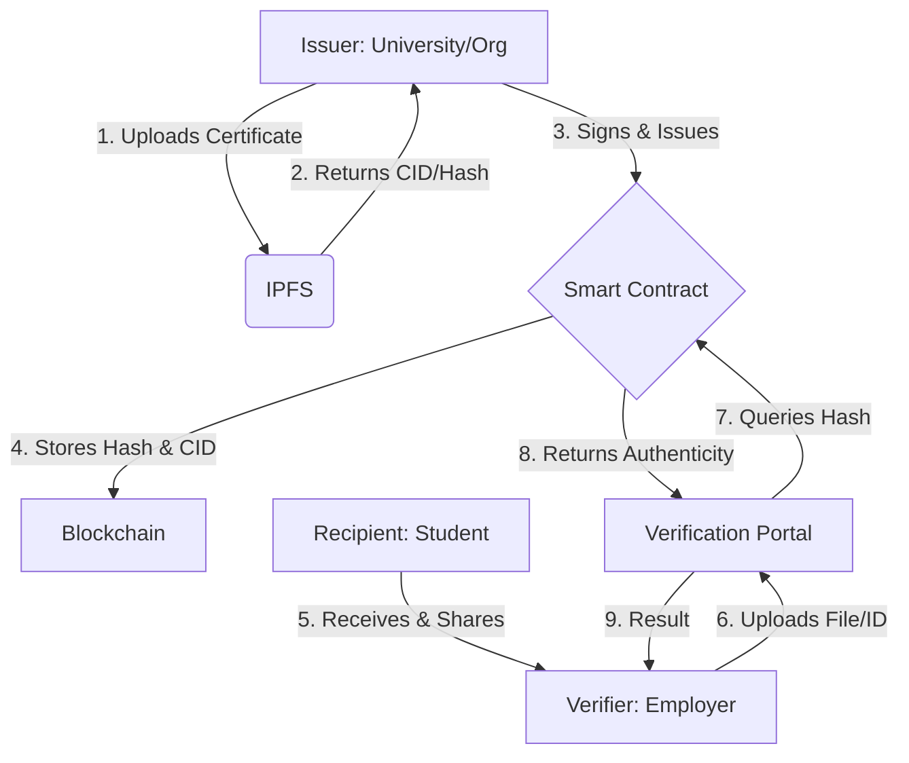

# System Design: Decentralized Certificate Verification System

This document outlines the architectural design and workflow of the Decentralized Certificate Verification System.

## 1. Overview
The system leverages blockchain technology and decentralized storage to provide a secure, transparent, and immutable platform for issuing and verifying academic or professional certificates.

## 2. Core Components

- **Smart Contracts (Ethereum/Polygon)**:
    - Manage the registry of authorized Issuers.
    - Store certificate metadata (IPFS CID, recipient hash, issuance date).
    - Provide functions for issuance and public verification.
- **Decentralized Storage (IPFS)**:
    - Stores the actual certificate files (PDFs/Images) and JSON metadata.
    - Ensures data availability without centralized servers.
- **Frontend Application (React/Next.js)**:
    - **Issuer Dashboard**: For institutions to upload and issue certificates.
    - **Recipient Portal**: For users to view and share their credentials.
    - **Verification Portal**: A public tool to verify certificates via file upload or hash.
- **Identity Management (Wallet/DID)**:
    - Uses MetaMask or similar wallets for signing transactions.

## 3. System Architecture (Workflow)

## 4. Actors & Roles

- **Issuer**: An authorized entity (e.g., a university) that has the right to issue certificates.
- **Recipient**: The individual to whom the certificate is issued.
- **Verifier**: Any third party that needs to validate the authenticity of a certificate.

## 5. Security Considerations

- **Integrity**: Any change to the certificate file will result in a different hash, failing verification.
- **Authenticity**: Only addresses whitelisted in the Smart Contract as "Issuers" can successfully register certificates.
- **Privacy**: Only certificate hashes are stored on-chain; sensitive personal data is kept in the metadata (optionally encrypted).

